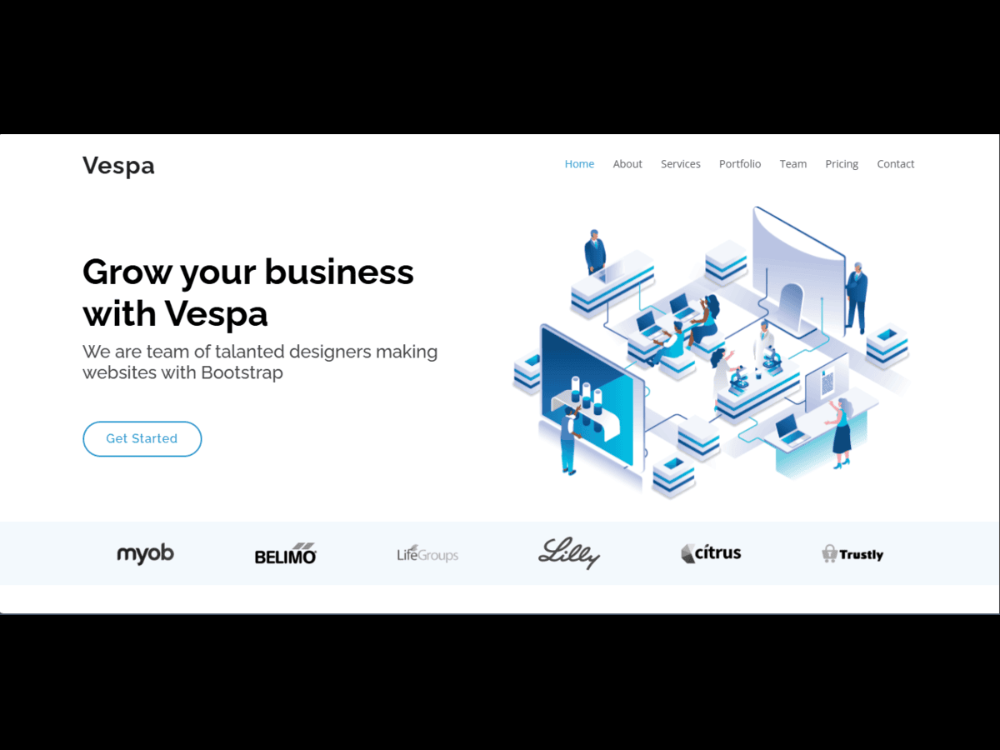

# VTheme - Modern Classic WordPress Landing Page Theme



VTheme is a modern, responsive **classic WordPress one-page landing page theme** developed from scratch using WordPress core features, PHP, Bootstrap, and JavaScript.

The theme was converted from a static HTML landing page into a fully dynamic WordPress theme, allowing administrators to manage website content directly from the WordPress Dashboard.

This theme follows the traditional WordPress theme architecture and does not use the WordPress Block Theme system or page builders.

---

## Features

- Modern Classic WordPress Theme
- One Page Landing Page Layout
- Responsive Bootstrap 5 Design
- Dynamic Header Navigation Menu
- Custom Logo Support
- Dynamic Hero Section
- About Section
- Services Management using Custom Post Type
- Portfolio Management using Custom Post Type
- Pricing Section
- Team Members Management using Custom Post Type
- Testimonials Management using Custom Post Type
- FAQ Management using Custom Post Type
- Dynamic Client Logos Section
- Theme Customizer Options
- Featured Image Support
- Clean and Organized Theme Structure

---

## Technologies Used

- WordPress
- PHP
- HTML5
- CSS3
- Bootstrap 5
- JavaScript
- jQuery
- AOS Animation Library
- Owl Carousel
- Git & GitHub
- XAMPP Local Development Environment

---

## WordPress Concepts Implemented

This theme demonstrates practical WordPress development concepts:

- Classic Theme Development
- Theme Setup (`after_setup_theme`)
- Asset Management (`wp_enqueue_scripts`)
- WordPress Template Files
- Custom Navigation Menus
- Custom Logo Support
- Theme Customizer API
- Custom Post Types
- WP_Query
- Featured Images
- Template Parts
- WordPress Hooks and Actions
- Data Sanitization
- Output Escaping

---

## Custom Post Types

The theme includes the following dynamic content sections:

### Services

Manage service cards from:

```
Dashboard → Services
```

### Portfolio

Manage projects from:

```
Dashboard → Portfolio
```

### Team Members

Manage team profiles from:

```
Dashboard → Team
```

### Testimonials

Manage customer reviews from:

```
Dashboard → Testimonials
```

### FAQ

Manage frequently asked questions from:

```
Dashboard → FAQs
```

### Client Logos

Manage company logos from:

```
Dashboard → Clients
```

---

## Installation

### Requirements

- WordPress 6.x or higher
- PHP 8.x recommended
- Local server (XAMPP/Laragon) or Web Hosting


### Installation Steps

1. Download or clone this repository.

```bash
git clone https://github.com/rihankabir/vtheme.git
```

2. Copy the theme folder into:

```
wp-content/themes/
```

3. Open WordPress Dashboard.

4. Go to:

```
Appearance → Themes
```

5. Activate:

```
VTheme
```

6. Create a Home page.

7. Set it as your homepage:

```
Settings → Reading → Homepage → Home
```

---

## Theme Structure

```
vtheme/

│
├── assets/
│   ├── css/
│   ├── js/
│   └── vendor/
│
├── template-parts/
│
├── functions.php
├── style.css
├── index.php
├── front-page.php
├── header.php
├── footer.php
├── screenshot.png
└── README.md
```

---

## Development Workflow

The theme was developed using:

- XAMPP for local WordPress development
- VS Code as the code editor
- Git for version control
- GitHub for repository management

---

## Future Improvements

Possible future enhancements:

- More Customizer options
- Translation readiness
- RTL support
- Advanced theme options panel
- Additional reusable sections
- Performance optimization

---

## Author

**Md. Rihanul Kabir**

GitHub:
https://github.com/rihankabir

---

## License

This project is created for learning, portfolio, and demonstration purposes.
